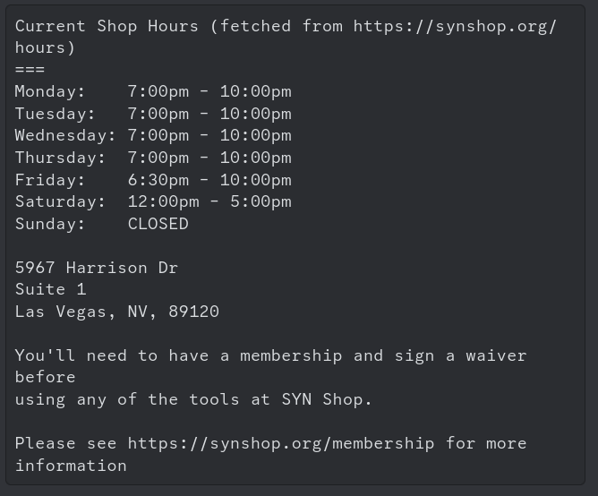
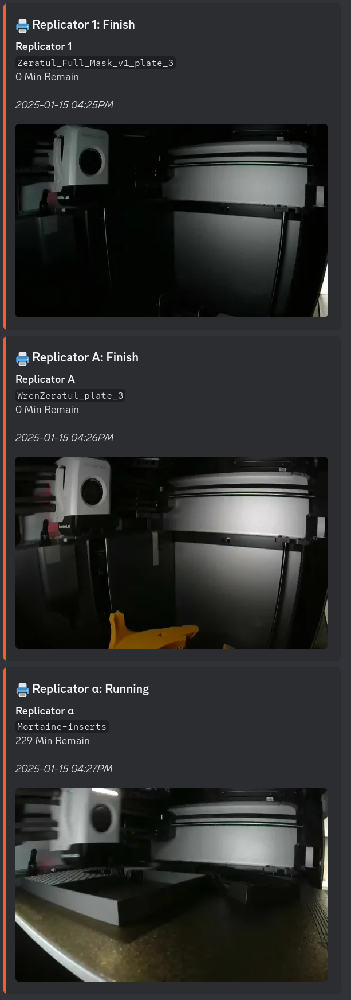

## SYN Shop Discord Answerbot

This is Discord bot was created initially to answer the question we get so much about our hackerspace in our discord server:
* When is the shop open?
* Where is the shop?
* What is the web site of the shop?
* How do I join?

Later, when we got a small fleet of [Bambu 3d printers](https://bambulab.com/en-us/x1), members often wanted to know the status of their prints, so we extended the bot to query the printers every minute and cache the status and print image in SQLite.  Then, when asked using the `PRINTER_STATUS` keyword, the bot asks the SQLite database to get the status and image for all the printers shows this in Discord.

The shop hour feature will only work for the SYN Shop as it's hard coded to to parse our shop hours.  However, if you set the shop hours keywords (see `PHRASES` in `config.py`) to be something noone knows, you could safely just use it for just the Bambu printer status features.

## Screenshots

Here's a screenshot of the shop hours which is dynamically pulled from synshop.org so it's always up to date:

Here's a screenshot of the printer status.  Each status update shows:
* Printer name
* Image of current (or most recent) job
* Job name
* Minutes remaining
* Timestamp of when the status was retrieved from the printer

## Production deploy on Docker

## Install 

1. Have a server you can run `docker compose` on
2. Install needed software: `apk add python3 openssh git py3-pip ffmpeg pkgconfig`
3. Check out the discord bot code: git clone https://github.com/synshop/discord_faqbot.git
4. Get into the `data` directory: `cd discord_faqbot/data`
5. Create the token file discord_token.py file with the production token: `cp discord_token_dist.py discord_token.py` . For steps on how to create the token, see [this write up](https://realpython.com/how-to-make-a-discord-bot-python/#creating-an-application).  The result is a 73 char string like `AAAAAAAAAAAAAAAAAAAAAAAAAA.BBBBBB.CCCCCCCCCCCCCCCCCCCCCCCCCCCCCCCCCCCCCC`
6. Create the config file config.py file: `cp config_dist.py config.py` . The contents are likely production ready and not need changes (unless you're not the SYN Shop ;)
7. Create the printer configuration file `cp printer_config_dist.py printer_config.py` .  Fill out all important information about the Bambu printers in the environment.
8. Start the service with `docker compose up -d`

## Upgrade

If a code is updated and you want to update your production instance:

1. get into the directory: `cd discord_faqbot`
2. rebuild image and restart the service: `docker compose up --build -d` 

## Development

Develop on what ever environment you want, just make sure you're path to `ffmpeg` is correct and your on the same LAN as your printers (or a VPN as needed if you're remote).  Then:

1. check out this repo and `cd` into it
2. Copy the 3 config files from production - consider changing the `PHRASES` and `PRINTER_STATUS` and `PRINTER_CHANNEL` to something different so you don't confuse other folks with seeing dupelicate content from another/same bot
3. Create a virtual env and activate it: `python3 -m venv venv;. venv/bin/activate`
4. Install wheel: `pip3 install --no-cache --upgrade  wheel`
5. Install dependencies: `pip3 install --no-cache --upgrade  -r requirements.txt`
6. In one terminal run the discord bot `python main.py`
7. In another terminal run the printer status looop: `python loop_over_printers.py`

Another option, instead of using your main community discord server, is to create another discord server, another [app token](https://realpython.com/how-to-make-a-discord-bot-python/#creating-an-application) and set the config to use this server.  That way you can safely test totally in a seperate environment from productoin.
